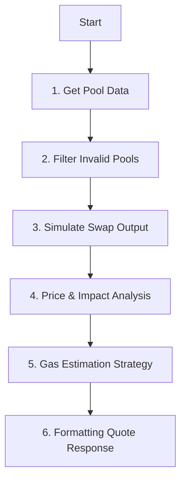

# Fetch Quote

## What is Fetch Quote?
**Fetch Quote** is the process where the Aggregator asks multiple DEXs: *"If I give you X amount of Token A, how much Token B will you give me?"*

It is not just a simple price check. It involves:
1.  **Discovery**: Finding which pools (V2/V3) actually have the tokens.
2.  **Simulation**: Running the math to see the real output after fees and slippage.
3.  **Optimization**: Comparing all options to find the single best route.

## The Goal (What we get)
At the end of this process, we get a **Quote Object** containing:
*   **Amount Out**: The final number of tokens you will receive.
*   **Route Path**: The exact steps (e.g., `USDC -> WETH -> USDT`) to execute the swap.
*   **Fees & Gas**: The estimated cost to execute the transaction.
*   **Price Impact**: How much you are "moving the market" (slippage).

---

# Route Discovery Logic (Piece by Piece)

This document explains the core logic used to discover routes, calculate quotes, and format the response.



---

## 1. Get Pool Data

### A. Fetching Pool (Pair) Addresses
Before we can get reserves, we need to know *where* the reserves live.
*   **V2**: query `Factory.getPair(tokenA, tokenB)`
*   **V3**: query `Factory.getPool(tokenA, tokenB, fee)`

### B. Batch Fetching (The "AequiLens" Contract)
Fetching data for 20+ pools individually would result in 20+ RPC calls. **To solve this, we use a custom smart contract (`AequiLens`).**

*   **Mechanism**: Send a **single** `eth_call` to `batchGetV2PoolData` (or V3).
*   **On-Chain Logic**: The contract loops through addresses, calls `getReserves()`/`slot0()` in a `try-catch` block, and returns consolidated results.

| Protocol | Field | Description |
| :--- | :--- | :--- |
| **V2** | `reserve0`, `reserve1` | Essential for calculating price (`x/y`). |
| | `exists` | Boolean flag. `false` if the pool contract reverts or is empty. |
| **V3** | `sqrtPriceX96` | The current spot price encoded in Q64.96. |
| | `liquidity` | The depth of the pool at the current tick. |
| | `exists` | Boolean flag. |

**Why `try-catch`?**
In Ethereum, if one call fails, the **entire transaction reverts**.
*   **Without it**: One broken pool crashes the entire request.
*   **With it**: We "catch" the error, mark it `exists: false`, and keep fetching others.

---

## 2. Filter Invalid Pools

We filter out "dust pools" (low liquidity) to save CPU cycles.

```typescript
// V2 Filtering
if (reserveIn < this.config.minV2ReserveThreshold) continue;

// V3 Filtering
if (poolData.liquidity < this.config.minV3LiquidityThreshold) continue;
```
*   `minV2ReserveThreshold`: Ensures enough absolute token balance.
*   `minV3LiquidityThreshold`: Ensures the active tick supports a trade.

---

## 3. Simulate Swap Output

### V2 Calculation (Manual Math)
We use the standard Constant Product formula `x * y = k` with a 0.3% fee.
*Source*: [Uniswap V2 Library](https://github.com/Uniswap/v2-periphery/blob/master/contracts/libraries/UniswapV2Library.sol#L43)

```javascript
function getV2AmountOut(amountIn, reserveIn, reserveOut) {
    const amountInWithFee = amountIn * 997n;
    const numerator = amountInWithFee * reserveOut;
    const denominator = (reserveIn * 1000n) + amountInWithFee;
    return denominator === 0n ? 0n : numerator / denominator;
}
```

### V3 Calculation (The Quoter)
For V3, manual calculation is too complex (Tick Bitmaps). We trust the on-chain **Quoter Contract**.

```javascript
// We trust the node to run the complex V3 math
const amountOut = await quoter.callStatic.quoteExactInputSingle(
  tokenIn, tokenOut, amountIn, fee, 0
);
```

---

## 4. Price & Impact Analysis

### Why do we calculate this?
1.  **Route Optimization**: The router actively selects lower-impact routes as a tie-breaker (See `route-planner.ts`).
2.  **User Protection**: This value is returned to the Frontend, enabling it to show specific warnings for high-slippage trades (Safety Feature).

### Mid Price (Fair Market Price)
**"The real liquidity price based on reserve tokens in the pool, without being charged any swap fee."**

*   **Formula**: `Reserve B / Reserve A`
*   **Analogy**: The price tag on the shelf ($1.00) before taxes or bulk discounts.

**V2 Formula**:
```javascript
// Price = ReserveOut / ReserveIn
const midPriceQ18 = (reserveOut * Q18) / reserveIn;
```

**V3 Formula**:
Derived from `sqrtPriceX96`.

> **Where do these magic numbers come from?**
> *   **`Q96` ($2^{96}$)**: Uniswap V3 stores price as a "Fixed Point Number" scaled by $2^{96}$ to save gas.
>     *   *Source*: [Uniswap V3 Whitepaper (Page 2, Eq 2.2)](https://uniswap.org/whitepaper-v3.pdf) -> $\sqrt{P} \cdot 2^{96}$
> *   **`Q192` ($2^{192}$)**: Since we square the price (`sqrt * sqrt`), the scale squares too ($2^{96} \cdot 2^{96} = 2^{192}$). We divide by this to get the real number back.

```javascript
function getV3MidPrice(sqrtPriceX96, inDecimals, outDecimals) {
    const Q18 = 1000000000000000000n;
    const Q96 = 2n ** 96n;
    
    // Formula: Price = (sqrtPrice / Q96) ^ 2
    // Calc: (sqrtPriceX96 * sqrtPriceX96) = Price * Q192
    const priceX96 = BigInt(sqrtPriceX96) * BigInt(sqrtPriceX96);
    
    // Adjust for decimals
    const inScale = 10n ** BigInt(inDecimals);
    const outScale = 10n ** BigInt(outDecimals);
    
    return (priceX96 * inScale * Q18) / (2n**192n * outScale);
}
```

### Execution Price (The Real Price)
The actual price you paid per token.
```javascript
const executionPriceQ18 = (amountOut * Q18) / amountIn;
```

### Price Impact (Slippage)
The percentage loss due to trade size.
*Analogy*: "I paid 5% extra because I bought too much."

```javascript
const idealOut = (amountIn * midPriceQ18) / Q18;
const shortfall = idealOut - amountOut;
const impactBps = (shortfall * 10000n) / idealOut;
```

---

### 5. Gas Estimation Strategy

**What is a "Heuristic Constant"?**
"Heuristic" means **"A practical method not guaranteed to be perfect, but sufficient for the immediate goal."**
In code terms: **"Hardcoded Averages based on historical data."**
We use these fixed numbers instead of calculating fresh every time to save milliseconds.

### Why not Simulate All?
**Question**: *"Why not use `eth_estimateGas` for everything?"*
**Answer**: **Latency (Speed).**
*   **Discovery**: We check **50+ routes**. Simulating 50 txs takes **~10 seconds**. (User leaves).
*   **Heuristics**: Math takes **<1ms**. (User stays).
*   **Execution**: We only simulate the **Final Winner** (1 tx) to get the perfect fee for the wallet.

### The Proof (Source Links)

| Constant | Value | Source & Proof |
| :--- | :--- | :--- |
| **Gas Base** | **50,000** | **EVM Specs**: [Ethereum Yellow Paper](https://ethereum.github.io/yellowpaper/paper.pdf). <br> • Transaction Base: **21,000** <br> • Token Transfer (ERC20): **~29,000** (SSTORE cost is 20k for new storage + CALL overhead). |
| **V2 Swap** | **70,000** | **Benchmark**: [Uniswap V2 vs V3 Gas Costs](https://medium.com/coinmonks/uniswap-v3-gas-fees-in-depth-comparison-fd53b802a82d). <br> • V2 Swap Total: ~100k - 50k (Base) = **50k-70k** logic cost. |
| **V3 Swap** | **110,000** | **Benchmark**: [Uniswap V3 Gas Costs](https://uniswap.org/blog/uniswap-v3). <br> • V3 Swap Total: ~130k. Higher because of "Tick Crossing" (writing to 256-bit bitmap). |
| **Multi-Hop** | **20,000** | **EVM Specs**: [EIP-2929](https://eips.ethereum.org/EIPS/eip-2929). <br> • A "Hop" means a `CALL` to another contract (**2600 gas**) + storage reading SLOTS (**2100 gas**) + overhead. 20k is a safe buffer for the Router loop. |

```javascript
// The Heuristic Formula
function estimateGas(hops) { 
    const GAS_COSTS = { v2: 70000n, v3: 110000n };
    let total = 50000n; 
    for (const hop of hops) total += GAS_COSTS[hop];
    if (hops.length > 1) total += (hops.length - 1) * 20000n;
    return total;
}
```

### Scenarios (How Data is Handled)

#### Scenario A: Direct Swap (1 Hop)
*   **Route**: `USDC -> USDT` (via Uniswap V3)
*   **Hops Array**: `['v3']`
*   **Math**:
    1.  Base: **50,000**
    2.  Hop 1 (V3): + **110,000**
    3.  Overhead: 0 (Length is 1)
    4.  **Total**: **160,000**

#### Scenario B: Multi-Hop Swap (2 Hops)
*   **Route**: `USDC -> WETH -> USDT`
*   **Hops Array**: `['v3', 'v2']` (V3 first, then V2)
*   **Math**:
    1.  Base: **50,000**
    2.  Hop 1 (V3): + **110,000**
    3.  Hop 2 (V2): + **70,000**
    4.  Overhead: + **20,000** (Router has to loop once)
    5.  **Total**: **250,000**

---

## 6. Formatting Quote Response (The `PriceQuote` Object)

The `fetchDirectQuote` and `fetchMultiHopQuote` functions return a `PriceQuote` object (defined in `@aequi/core`).

**Interface Definition**:
```typescript
interface PriceQuote {
  chain: string           // e.g., 'sepolia' or 'ethereum'
  amountIn: bigint        // Raw input amount
  amountOut: bigint       // Raw output amount
  priceQ18: bigint        // Execution price (Q18)
  executionPriceQ18: bigint
  midPriceQ18: bigint     // Mid price (Q18)
  priceImpactBps: number  // Basis points (e.g., 50 = 0.5%)
  path: TokenMetadata[]   // The token path
  routeAddresses: Address[]
  sources: PriceSource[]  // Detailed hop info
  hopVersions: RouteHopVersion[] // ['v3', 'v2']
  estimatedGasUnits: bigint
  estimatedGasCostWei: bigint
}
```

**Example JSON Data**:
```json
{
  "chain": "sepolia",
  "amountIn": "1000000000000000000",
  "amountOut": "909283120391230129",
  "priceImpactBps": 145, 
  "hopVersions": ["v3", "v2"],
  "estimatedGasUnits": "250000",
  "path": [
    { "symbol": "USDC", "address": "0x..." },
    { "symbol": "WETH", "address": "0x..." },
    { "symbol": "USDT", "address": "0x..." }
  ]
}
```