# Multi-Hop Routing

## What is Multi-Hop?
**Multi-Hop** is a trading strategy where we don't swap directly from Token A to Token B. Instead, we use an "Intermediate Token" (like a bridge) to find a better price.

**Short Example**:
*   **Direct**: `WETH -> USDT` (Price: $3000)
*   **Multi-Hop**: `WETH -> USDC -> USDT` (Price: $3005)
*   *Result*: You get **$5 more** by hopping through USDC.

---

## The Logic (Step-by-Step)

This process is handled by `fetchMultiHopQuotes` in `pool-discovery.ts`. It follows a strict pipeline to discover, simulate, and combine routes.

### Visual Flow

```mermaid
sequenceDiagram
    participant App
    participant PD as PoolDiscovery
    participant BC as Blockchain/DexAdapters

    App->>PD: fetchMultiHopQuotes(TokenIn, TokenOut)
    
    rect rgb(30, 30, 30)
        Note left of PD: 1. Identify Intermediaries
        PD->>PD: Filter Candidates (excl. In/Out)
        PD->>BC: Batch Fetch Token Metadata
    end
    
    rect rgb(30, 40, 60)
        Note left of PD: 2. Leg A (In -> Intermediate)
        PD->>BC: fetchDirectQuotes(In, Mid) [PARALLEL]
        BC-->>PD: Returns [Quote A1, Quote A2...]
    end

    rect rgb(30, 60, 40)
        Note left of PD: 3. Leg B (Intermediate -> Out)
        loop For Each Unique AmountOut from Leg A
            PD->>BC: fetchDirectQuotes(Mid, Out, AmountFromLegA)
        end
        BC-->>PD: Returns [Quote B1, Quote B2...]
    end

    rect rgb(60, 30, 30)
        Note left of PD: 4. Combinatorial Merge
        PD->>PD: Multiply Prices (Mid * Mid)
        PD->>PD: Add Gas & Impact
        PD->>PD: Combine Paths [In, Mid, Out]
    end

    PD-->>App: Return Combined PriceQuote[]
```



### 1. Identify Intermediaries
We don't test every token in existence. We only test **Liquid Base Tokens** defined in our config (e.g., `WETH`, `USDC`, `USDT`, `DAI`).
*   *Code Limit*: We filter out candidates that are the same as Input or Output to avoid loops.

```typescript
// pool-discovery.ts
// Filter out input/output tokens to prevent A -> A -> B or A -> B -> B
const validCandidates = intermediateAddresses.filter(
  (candidate) => !sameAddress(candidate, tokenIn.address) && 
                 !sameAddress(candidate, tokenOut.address)
)
```

### 2. Fetch Leg A (Input -> Intermediate)
We run `fetchDirectQuotes` in **parallel** for all candidate tokens.
*   **Goal**: Find all ways to turn `Token In` into `Intermediate Token`.
*   *Example*: Get quotes for `WETH -> USDC` and `WETH -> DAI`.

```typescript
// Parallel Execution
const legAQuotesArray = await Promise.all(
  intermediateTokens.map(intermediate => 
    this.fetchDirectQuotes(chain, tokenIn, intermediate, amountIn, ...)
  )
)
```

### 3. Fetch Leg B (Intermediate -> Output)
For every successful Leg A quote, we take the **Amount Out** and use it as the **Amount In** for the second leg.
*   **Goal**: Turn the `Intermediate Token` into `Token Out`.
*   *Example*: Take the `USDC` we got from Leg A and swap it for `USDT`.

```typescript
// Unique Amount Optimization
// We collect unique output amounts to avoid duplicate RPC calls
const uniqueAmounts = new Set(legAQuotes.map(q => q.amountOut));

const legBQuotesArray = await Promise.all(
  legAQuotes.map(legA => 
    this.fetchDirectQuotes(chain, intermediate, tokenOut, legA.amountOut, ...)
  )
)
```

### 4. Combinatorial Merge (The "Glue")
Now we have two separate arrays of quotes. We must **multiply** them together to form a complete path.

**The Math**:
*   **Mid Price**: `LegA.Mid * LegB.Mid`
*   **Execution Price**: `LegA.Exec * LegB.Exec`
*   **Price Impact**: `LegA.Impact + LegB.Impact`
*   **Gas**: `LegA.Gas + LegB.Gas + Overhead`

```typescript
// Combining Legs
const { mid, execution } = {
  mid: multiplyQ18(legA.midPriceQ18, legB.midPriceQ18),
  execution: multiplyQ18(legA.executionPriceQ18, legB.executionPriceQ18)
}

const combinedHopVersions = [...legA.hopVersions, ...legB.hopVersions];
// Result: ['v3', 'v2']
```

### 5. Final Result
The function returns an array of **Combined Quotes**.
*   **Path**: `[TokenIn, Intermediate, TokenOut]`
*   **Hops**: `['v3', 'v2']`
*   **Total Gas**: `110k + 70k + 20k = 200k`

---

## Example Response (The Data Structure)
Here is what the **PriceQuote[]** array looks like when containing both a Direct Quote and a Multi-Hop Quote.

```json
[
  // 1. Direct Quote (WETH -> USDT)
  {
    "chain": "sepolia",
    "amountIn": "1000000000000000000", // 1 WETH
    "amountOut": "3000000000",          // 3000 USDT
    "priceImpactBps": 10,               // 0.10%
    "hopVersions": ["v3"],
    "path": [
      { "symbol": "WETH", "address": "0x..." },
      { "symbol": "USDT", "address": "0x..." }
    ],
    "sources": [
      { "dexId": "uniswap-v3", "tokenIn": "WETH", "tokenOut": "USDT" }
    ],
    "estimatedGasUnits": "160000"
  },

  // 2. Multi-Hop Quote (WETH -> USDC -> USDT)
  {
    "chain": "sepolia",
    "amountIn": "1000000000000000000", // 1 WETH
    "amountOut": "3005000000",          // 3005 USDT (Better Price!)
    "priceImpactBps": 45,               // 0.45% (Higher impact due to 2 pools)
    "hopVersions": ["v3", "v2"],        // Mixed Protocols
    "path": [
      { "symbol": "WETH", "address": "0x..." },
      { "symbol": "USDC", "address": "0x..." }, // Intermediate
      { "symbol": "USDT", "address": "0x..." }
    ],
    "sources": [
      { "dexId": "uniswap-v3", "tokenIn": "WETH", "tokenOut": "USDC" },
      { "dexId": "uniswap-v2", "tokenIn": "USDC", "tokenOut": "USDT" }
    ],
    "estimatedGasUnits": "250000"       // Higher Gas
  }
]
```
