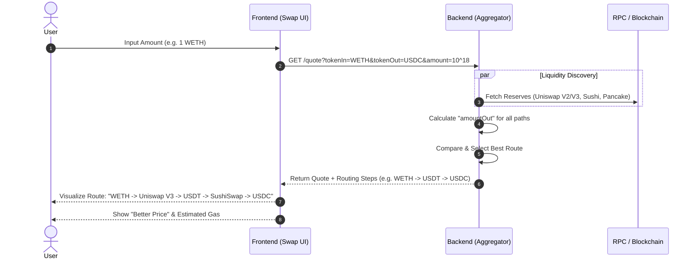

| **Figma Link** | No Provided Yet (TBD) |
| --- | --- |

# Overview

**Smart Route Visualization** is the visual representation of the aggregation engine's pathfinding logic. It translates complex on-chain routing data into a clear, intuitive diagram that helps users understand *why* a specific path offers the best price.

The system focuses on the discovery phase:
1.  **Liquidity Discovery**: Real-time querying of multiple DEXs (Uniswap V2/V3, SushiSwap, PancakeSwap) on Sepolia.
2.  **Path Calculation**: Evaluating splits and multi-hop routes (e.g., `WETH` -> `USDT` -> `USDC`) to maximize output.
3.  **Visualization**: Rendering the exact route steps, fees, and protocols involved.

# Route Discovery & Visualization — Straight Flow

1.  **User inputs swap amount** (e.g., 1 WETH)
2.  **Frontend sends quote request** to the backend API
3.  **Backend fetches liquidity reserves** from all supported DEXs (Uniswap, Sushi, Pancake) in parallel
4.  **Backend calculates potential output** for every possible direct and multi-hop path
5.  **Backend compares all paths** and selects the one with the highest return (considering gas costs)
6.  **Backend returns the best quote** and detailed routing steps to the frontend
7.  **Frontend visualizes the route path**, showing exactly which DEXs and tokens are used
8.  **Frontend displays the "Better Price"** and estimated gas fees to the user
