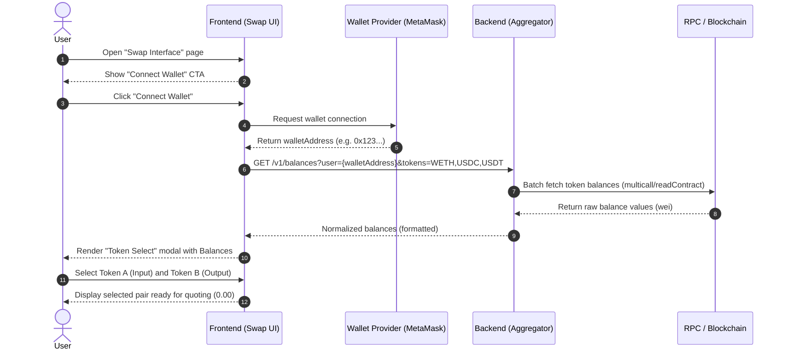

| **Figma Link** | No Provided Yet (TBD) |
| --- | --- |

# Overview

**Swap Interface** is the primary interaction point where users connect their wallet and select tokens to swap on the Sepolia testnet. It provides an intuitive way to manage wallet connections (`Connect Wallet`) and view token balances before initiating a trade.

The interface focuses on supporting the following key tokens on Sepolia:

- **WETH (Wrapped Ether)**
    - `0xfFf9976782d46CC05630D1f6eBAb18b2324d6B14`
- **USDC (USD Coin)**
    - `0x1c7D4B19F23267E141703290b633A42F99b9C7238`
- **USDT (Tether USD)**
    - `0xfa8499996E7596c56149172B8B1fD97642646c24`
- **UNI (Uniswap Token)**
    - `0x1f9840a85d5aF5bf1D1762F925BDADdC4201F984`

# Connect & Select — Straight Flow

1. **User opens Swap Interface page**
2. **User clicks “Connect Wallet”**
3. **Wallet returns wallet address** to the frontend (verifying connection status)
4. **Frontend sends request to backend** with the wallet address and list of supported tokens
5. **Backend queries Blockchain (RPC)** for token balances
6. **Backend normalizes balance data** (converts Wei to human-readable format)
7. **Backend returns user’s token balances** to the frontend
8. **Frontend renders Token Selection List** with current balances displayed next to each token
9. **User selects Token A (Input) and Token B (Output)**
10. **Frontend updates the UI state**, ready for the user to input a swap amount
