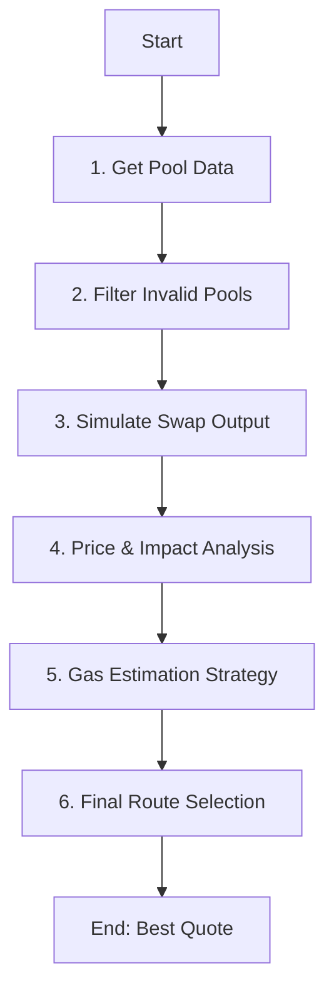

| **Figma Link** | No Provided Yet (TBD) |
| --- | --- |

# Overview
**Route Discovery Logic** is the core algorithm determining the most profitable path for swapping tokens. It systematically searches both direct and multi-hop paths across multiple decentralized exchanges (DEXs), simulates execution to account for fees and gas, and ranks the results to find the "Best Quote."

# Route Discovery Logic (Piece by Piece)

The aggregation logic follows a strict pipeline to ensure accuracy and profitability.



### 1. Get Pool Data

#### A. Fetching Pair Addresses
Before we can get reserves, we need to know *where* the reserves live. We query the **Factory Contract** of each DEX (Uniswap, Sushi, Pancake) using `getPair(tokenA, tokenB)` or `getPool(tokenA, tokenB, fee)`.

#### B. Batch Fetching (The "AequiLens" Contract)
Fetching data for 20+ pools individually would result in 20+ RPC calls, leading to high latency. To solve this, we use a custom smart contract called **AequiLens**.

**Mechanism**: We send a **single** `eth_call` to `AequiLens.batchGetV2PoolData` (or V3).
**On-Chain Logic**: The contract loops through the requested addresses, calls `getReserves()` / `slot0()` in a try-catch block, and returns a consolidated array of results.

| Protocol | Field | Description |
| :--- | :--- | :--- |
| **V2 (Uniswap/Sushi)** | `reserve0`, `reserve1` | Essential for calculating price (`x/y`). |
| | `token0`, `token1` | To map reserves correctly to Input/Output. |
| | `exists` | Boolean flag to filter out invalid addresses (pool not found). |
| **V3 (Uniswap/Pancake)** | `sqrtPriceX96` | The current spot price encoded in Q64.96. |
| | `tick` | The current active tick index. |
| | `liquidity` | The depth of the pool at the current tick (available to trade). |
| | `fee` | The swap fee tier (e.g., 3000 for 0.3%). |
| | `exists` | Boolean flag to filter out invalid addresses. |

**Code Snippet (AequiLens.sol - V2 Batching)**
```solidity
function batchGetV2PoolData(address[] calldata pairs) external view returns (V2PoolData[] memory) {
    V2PoolData[] memory results = new V2PoolData[](pairs.length);
    for (uint256 i = 0; i < pairs.length; i++) {
        // ... (check code length)
        try IPairV2(pair).getReserves() returns (uint112 r0, uint112 r1, uint32) {
            results[i] = V2PoolData({
                pairAddress: pair,
                reserve0: r0, 
                reserve1: r1,
                token0: IPairV2(pair).token0(),
                token1: IPairV2(pair).token1(),
                exists: true
            });
        } catch {
            results[i].exists = false; 
        }
    }
    return results;
}
```

> **Why `try-catch`?**
> In Ethereum, if one call fails, the **entire transaction reverts**.
> *   **Without it**: One broken pool would fail the whole request.
> *   **With it**: We "catch" the error, mark it as `exists: false`, and keep going. This makes the system resilient.

### 2. Filter Invalid Pools
We filter out "dust pools" (low liquidity) to save CPU cycles.

**Code implementation (`pool-discovery.ts`)**
```typescript
// V2 Filtering
if (reserveIn < this.config.minV2ReserveThreshold || reserveOut < this.config.minV2ReserveThreshold) {
    continue // Skip this pool
}

// V3 Filtering
if (poolData.liquidity < this.config.minV3LiquidityThreshold) {
    continue // Skip this pool
}
```

### 3. Simulate Swap Output (`amountOut`)

#### V2 Calculation (Manual Code)
We calculate `x * y = k` directly using Javascript BigInts (No SDK).
```javascript
function getV2AmountOut(amountIn, reserveIn, reserveOut) {
    // 1. Apply 0.3% Fee (Amount * 997)
    const amountInWithFee = amountIn * 997n;
    
    // 2. Calculate Numerator
    const numerator = amountInWithFee * reserveOut;
    
    // 3. Calculate Denominator (Reserve*1000 + AmountWithFee)
    const denominator = (reserveIn * 1000n) + amountInWithFee;
    
    // 4. Final Division
    return denominator === 0n ? 0n : numerator / denominator;
}
```

#### V3 Calculation (The Quoter)
For V3, we trust the on-chain **Quoter Contract** because local tick math is too complex.
```javascript
// We trust the node to run the complex V3 math
const amountOut = await quoter.callStatic.quoteExactInputSingle(tokenIn, tokenOut, amountIn, fee, 0);
```

### 4. Price & Impact Analysis

#### A. Mid Price (Fair Market Price)
**Definition**: The theoretical "fair" price if you traded 0.000001 tokens. Purely the ratio of reserves.

**V2 Manual Formula**:
```javascript
// Price = ReserveOut / ReserveIn
const midPriceQ18 = (reserveOut * 1000000000000000000n) / reserveIn;
```

**V3 Manual Formula**:
```javascript
function getV3MidPrice(sqrtPriceX96, inDecimals, outDecimals) {
    const Q18 = 1000000000000000000n;
    const Q96 = 2n ** 96n;
    const Q192 = 2n ** 192n;
    // Price = (sqrtPrice / Q96) ^ 2
    const priceX96 = BigInt(sqrtPriceX96) * BigInt(sqrtPriceX96);
    // Adjust decimals
    const inScale = 10n ** BigInt(inDecimals);
    const outScale = 10n ** BigInt(outDecimals);
    return (priceX96 * inScale * Q18) / (Q192 * outScale);
}
```

#### B. Price Impact (Slippage)
**Definition**: Value lost due to your trade size shifting the pool price.
Formula: `(MidPrice - ExecutionPrice) / MidPrice`

```javascript
// 1. Execution Price (Real Price)
const executionPriceQ18 = (amountOut * Q18) / amountIn;

// 2. Ideal Output (If 0 slippage)
const idealOut = (amountIn * midPriceQ18) / Q18;

// 3. The Shortfall (Loss)
const shortfall = idealOut - amountOut;

// 4. Impact in BPS (Basis Points)
const impactBps = (shortfall * 10000n) / idealOut;
```

### 5. Gas Estimation Strategy

#### The "Two-Phase" Strategy
1.  **Phase 1 (Discovery)**: We use **Heuristics** (Math) to rank 50+ routes instantly (<1ms).
2.  **Phase 2 (Execution)**: We use **Simulation** (`eth_estimateGas`) only on the final winner for 100% accuracy.

> **Is this Industry Standard?**
> Yes. The **Uniswap Smart Order Router (SOR)** does exactly this.
> *   **Source**: [Uniswap SOR GasModel.ts](https://github.com/Uniswap/smart-order-router/blob/main/src/routers/alpha-router/gas-models/gas-model.ts)
> *   *Method*: "Estimates gas cost using a heuristic model based on hops."

#### Heuristic Constants & Justification
*   **Gas Base (50,000)**: 
    *   **Source**: Ethereum Yellow Paper (21k Base + ~29k Token Transfer).
*   **V2 Swap Cost (70,000)**: 
    *   **Source**: [Uniswap V2 vs V3 Benchmarks](https://medium.com/coinmonks/uniswap-v3-gas-fees-in-depth-comparison-fd53b802a82d). ~100k total - base.
*   **V3 Swap Cost (110,000)**: 
    *   **Reason**: Higher due to "Tick Crossing" (writing to bitmap).
*   **Multi-Hop Overhead (20,000)**: 
    *   **Reason**: Router contract decoding & looping overhead.

```javascript
function estimateGas(hops) {
    const GAS_COSTS = { v2: 70000n, v3: 110000n };
    let total = 50000n; // Base
    for (const hop of hops) total += GAS_COSTS[hop];
    if (hops.length > 1) total += BigInt(hops.length - 1) * 20000n; // Overhead
    return total;
}
```

### 6. Final Selection
We sort all valid quotes to find the best one:
1.  **Net Output**: `amountOut - estimatedGasCost` (Highest wins)
2.  **Liquidity**: Deeper liquidity wins ties.
3.  **Price Impact**: Lower impact wins ties.
